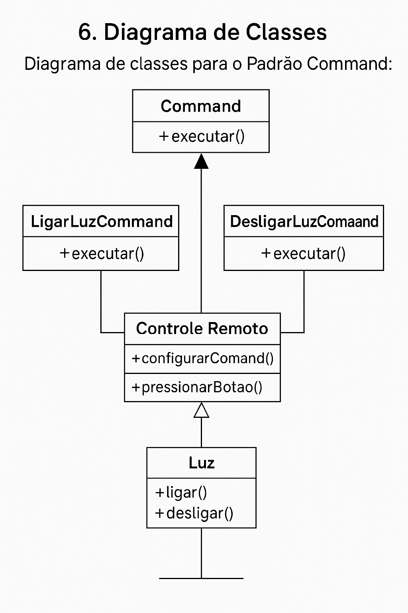

# Design Patterns
- Command(Comportamento)

## Slide apresentação
[](https://www.canva.com/design/DAGmCYrtTXs/vNsn56iSsywoRA-ER0ilqQ/edit?...)


## Diagrama de classes para o exemplo a seguir


## Exemplo Node.js
- O **ORM (Object Relational Mapping) Prisma** já possui implícitamente vários patterns de projeto, como o Repository Pattern e o Data Mapper Pattern, também o Singleton Pattern, que é utilizado para garantir que uma classe tenha apenas uma instância e fornecer um **ponto de acesso global** a ela.


### Exemplo do pattern Command
./controller/comandos.js
```
const { PrismaClient } = require('@prisma/client');
const prisma = new PrismaClient();

const create = async (req, res) => {
    try {
        const { tipo, usuarioId, luzId } = req.body;

        if (!['ligar', 'desligar'].includes(tipo)) {
            return res.status(400).json({ message: 'Tipo inválido. Use "ligar" ou "desligar".' });
        }

        await prisma.luz.update({
            where: { id: luzId },
            data: { estado: tipo === 'ligar' }
        });

        const comando = await prisma.comando.create({
            data: {
                tipo,
                usuarioId,
                luzId
            }
        });

        res.status(201).json(comando);
    } catch (e) {
        res.status(500).json({ erro: e.message });
    }
};

const undo = async (req, res) => {
    try {
        const { usuarioId } = req.body;

        const ultimoComando = await prisma.comando.findFirst({
            where: {
                usuarioId,
                desfazido: false
            },
            orderBy: {
                criadoEm: 'desc'
            }
        });

        if (!ultimoComando) {
            return res.status(404).json({ message: 'Nenhum comando para desfazer.' });
        }

        const tipoInverso = ultimoComando.tipo === 'ligar' ? 'desligar' : 'ligar';

        await prisma.luz.update({
            where: { id: ultimoComando.luzId },
            data: { estado: tipoInverso === 'ligar' }
        });

        await prisma.comando.update({
            where: { id: ultimoComando.id },
            data: { desfazido: true }
        });

        const comandoDesfeito = await prisma.comando.create({
            data: {
                tipo: tipoInverso,
                usuarioId,
                luzId: ultimoComando.luzId
            }
        });

        res.json(comandoDesfeito);
    } catch (e) {
        res.status(500).json({ erro: e.message });
    }
};

const read = async (req, res) => {
    try {
        const comandos = await prisma.comando.findMany({
            include: {
                usuario: true,
                luz: true
            },
            orderBy: { criadoEm: 'desc' }
        });
        res.json(comandos);
    } catch (e) {
        res.status(500).json({ erro: e.message });
    }
};

module.exports = {
    create,
    undo,
    read
};
```
./controller/usuario.js
```
const { PrismaClient } = require('@prisma/client');
const prisma = new PrismaClient();

const create = async (req, res) => {
    try {
        const { nome } = req.body;

        const usuario = await prisma.usuario.create({
            data: { nome }
        });

        res.status(201).json(usuario);
    } catch (e) {
        res.status(500).json({ erro: e.message });
    }
};

const read = async (req, res) => {
    try {
        const usuarios = await prisma.usuario.findMany({
            include: { comandos: true }
        });
        res.json(usuarios);
    } catch (e) {
        res.status(500).json({ erro: e.message });
    }
};

module.exports = {
    create,
    read
};
```
.controller/luz.js
```const { PrismaClient } = require('@prisma/client');
const prisma = new PrismaClient();

const create = async (req, res) => {
    try {
        const { nome } = req.body;

        const luz = await prisma.luz.create({
            data: { nome }
        });

        res.status(201).json(luz);
    } catch (e) {
        res.status(500).json({ erro: e.message });
    }
};

const read = async (req, res) => {
    try {
        const luzes = await prisma.luz.findMany({
            include: { comandos: true }
        });
        res.json(luzes);
    } catch (e) {
        res.status(500).json({ erro: e.message });
    }
};

const atualizarEstado = async (req, res) => {
    try {
        const { id } = req.params;
        const { estado } = req.body;

        const luz = await prisma.luz.update({
            where: { id: parseInt(id) },
            data: { estado }
        });

        res.json(luz);
    } catch (e) {
        res.status(500).json({ erro: e.message });
    }
};

module.exports = {
    create,
    read,
    atualizarEstado
};
`````
- Neste exemplo  O padrão Command (Command Pattern) é um padrão de design comportamental usado para encapsular uma ação (ou comando) como um objeto independente.

### Exemplo do pattern Composite
-Com o ORM Prisma, o padrão Command pode ser implementado ao registrar cada ação do usuário (como ligar ou desligar uma luz) como um objeto persistente no banco de dados. Cada entrada no modelo Comando representa uma solicitação de ação que pode ser executada, desfeita, registrada ou reprocessada.

Esse padrão é útil quando se deseja:

Manter histórico de todas as ações realizadas.

Permitir a desfazer/refazer ações.

Desacoplar quem solicita uma ação de quem a executa.

- Neste exemplo, você pode usar include: { luz: true, usuario: true } ao buscar um comando, para incluir os detalhes da luz e do usuário relacionados à ação.

